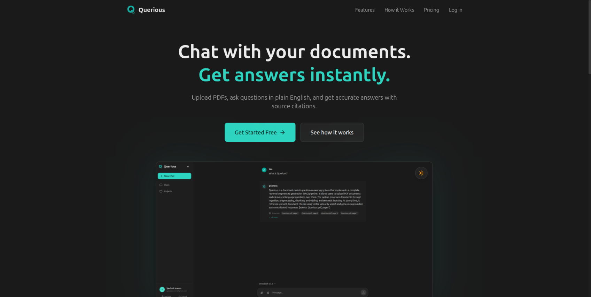
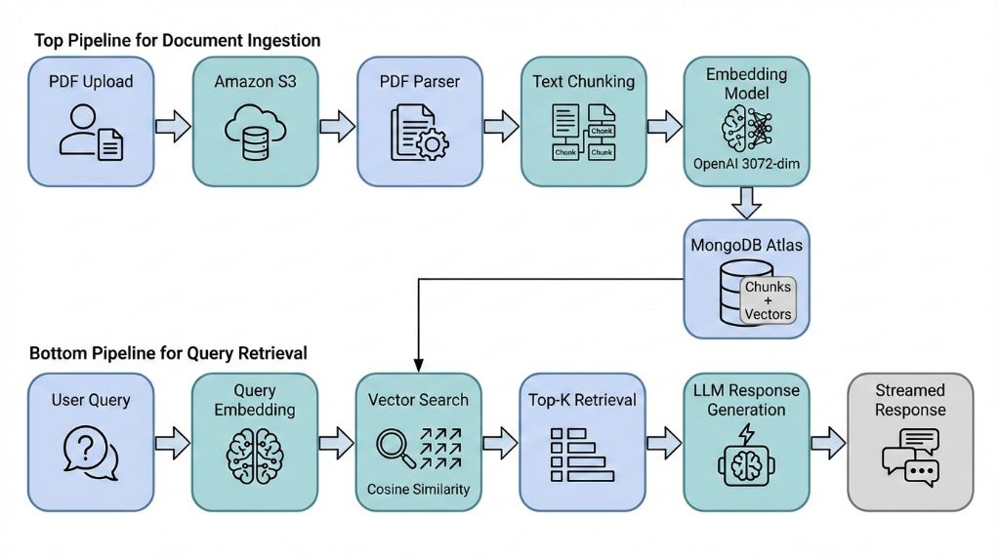

# Querious - Chat with your documents



Querious is an intelligent document Q&A agent that allows you to upload PDFs and ask questions in plain English. It uses RAG (Retrieval-Augmented Generation) to provide accurate answers with source citations.

## Features

- **Document Ingestion**: Upload PDF documents which are processed, chunked, and embedded for search.
- **RAG Powered Q&A**: Ask questions and get answers based _only_ on your documents to reduce hallucinations.
- **Source Citations**: Every answer includes citations linking back to the specific part of the document usable for verification.
- **Project Organization**: Group chats and documents into projects.
- **Secure Authentication**: Full user management with secure password hashing and session control.
- **Dark/Light Themes**: Modern interface with theme support.

## Screenshots

### Chat Interface


### Projects


## Tech Stack

- **Frontend**: React, TypeScript, Vite, Tailwind CSS, TanStack Query
- **Backend**: Python (FastAPI), MongoDB (Data + Vector Storage)
- **AI**: OpenAI (Embeddings), DeepSeek (LLM)
- **Infrastructure**: Inngest (Background Jobs), AWS S3 (File Storage)

## Architecture



The system uses a two-pipeline RAG (Retrieval-Augmented Generation) architecture:

- **Document Ingestion**: PDFs are uploaded to S3, parsed, chunked, embedded via OpenAI, and stored in MongoDB Atlas with vector indexes.
- **Query Retrieval**: User queries are embedded, matched via cosine similarity, and the top-K chunks are fed to the LLM for response generation.

## Development vs Production

### Branches

| Branch | Purpose                                                                                                                        |
| ------ | ------------------------------------------------------------------------------------------------------------------------------ |
| `main` | **Production only.** Deployed automatically to Vercel (frontend) and Fly.io (backend). Do not develop directly on this branch. |
| `dev`  | **Local development.** Contains localhost configs and dev tooling. All development work happens here.                          |

### Key Differences

| Config     | `dev` Branch               | `main` Branch                   |
| ---------- | -------------------------- | ------------------------------- |
| Vite Proxy | Enabled (`localhost:8000`) | Disabled (uses Vercel rewrites) |
| API URLs   | `http://localhost:*`       | Production domains              |
| Inngest    | `is_production=False`      | `is_production=True`            |

## Local Development

### Quick Start

```bash
# Clone and checkout dev branch
git clone https://github.com/syedalijaseem/Querious.git
cd Querious
git checkout dev

# Backend setup
cp .env.example .env
# Fill in your API keys and MongoDB URI
uv sync
uv run uvicorn main:app --reload --port 8000

# Frontend setup (new terminal)
cd frontend
cp .env.example .env.local
npm install
npm run dev

# Inngest (new terminal, optional for background jobs)
npx inngest-cli@latest dev -u http://127.0.0.1:8000/api/inngest
```

### Required Environment Variables

| Variable           | Description                                                     |
| ------------------ | --------------------------------------------------------------- |
| `MONGODB_URI`      | MongoDB Atlas connection string                                 |
| `JWT_SECRET_KEY`   | Secret for JWT tokens (generate with `openssl rand -base64 32`) |
| `OPENAI_API_KEY`   | For embeddings                                                  |
| `DEEPSEEK_API_KEY` | For LLM responses                                               |
| `R2_*`             | Cloudflare R2 storage credentials                               |

### Ports

| Service            | Port   |
| ------------------ | ------ |
| Frontend (Vite)    | `5173` |
| Backend (FastAPI)  | `8000` |
| Inngest Dev Server | `8288` |

## Contributing

1. **Always branch from `dev`**, not `main`
2. Open PRs targeting `dev`
3. `main` is updated only via reviewed merges from `dev`

```bash
git checkout dev
git pull origin dev
git checkout -b feature/my-feature
# ... make changes ...
git push origin feature/my-feature
# Open PR to dev
```

## Setup Instructions

### Prerequisites

- Python 3.10+
- Node.js 18+
- MongoDB Atlas account
- AWS S3 bucket
- OpenAI & DeepSeek API keys

### Environment Variables

Copy `.env.example` to `.env` in the root directory and fill in your secrets:

```bash
cp .env.example .env
```

Copy `frontend/.env.example` to `frontend/.env.local`:

```bash
cp frontend/.env.example frontend/.env.local
```

### Installation

1. **Backend**:

   ```bash
   # Using uv (recommended)
   uv sync

   # Or using pip
   pip install -r requirements.txt
   ```

2. **Frontend**:
   ```bash
   cd frontend
   npm install
   ```

### Running Locally

1. **Start Backend**:

   ```bash
   uv run uvicorn main:app --reload --host 127.0.0.1 --port 8000
   ```

2. **Start Frontend**:

   ```bash
   cd frontend
   npm run dev
   ```

3. **Start Inngest** (for background jobs):
   ```bash
   npx inngest-cli@latest dev -u http://127.0.0.1:8000/api/inngest
   ```

## Plan Limits

| Plan    | Tokens        | Chats     | Projects  | Documents |
| ------- | ------------- | --------- | --------- | --------- |
| Free    | 10,000        | 3         | 1         | 3         |
| Pro     | 2,000,000/mo  | Unlimited | 10        | 30        |
| Premium | 15,000,000/mo | Unlimited | Unlimited | Unlimited |

## Deployment

### Required Environment Variables

> **⚠️ CRITICAL: JWT_SECRET_KEY must be set in production!**
>
> Without it, sessions won't persist across server restarts.

```bash
# Generate a secure key
openssl rand -base64 32

# Required variables
JWT_SECRET_KEY=<your-generated-key>
ENVIRONMENT=production
FRONTEND_URL=https://your-domain.com
MONGODB_URI=<your-mongodb-uri>
DEEPSEEK_API_KEY=<your-api-key>
CLOUDFLARE_R2_*=<your-r2-credentials>
```

### Platforms

- **Frontend**: Deploy to Netlify/Vercel with `npm run build`
- **Backend**: Deploy to Render/Fly.io with `uv run uvicorn main:app`

## License

This project is licensed under AGPL-3.0. If you use, modify, or deploy this code (including as a web service), you must open-source your changes under the same license.
